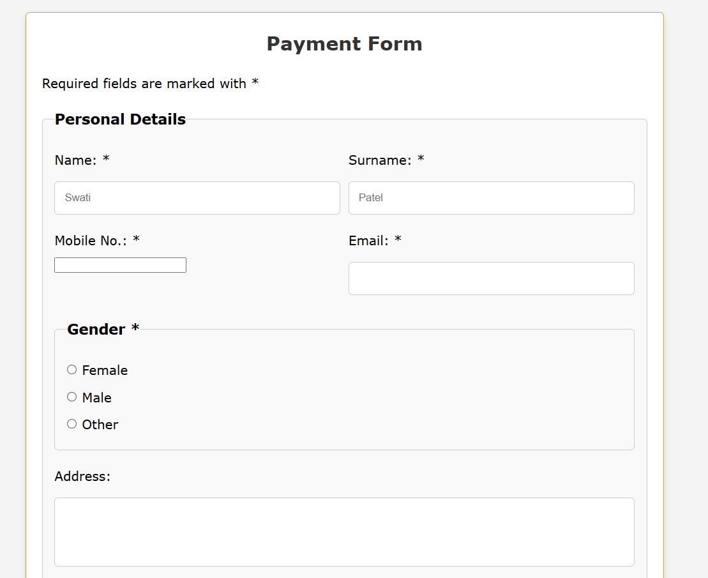

# swatipatel-payment-form
A responsive payment form built with HTML/CSS.


# Payment Form

A responsive payment form built with HTMLand CSS
## Live Demo
https://swatipatelhtml.netlify.app

## Tech Stack
- HTML5
- CSS3 (Flexbox / Grid)

- 
## Features
- Responsive layout
- Form validation (card number, expiry, CVV)
- Clean UI and accessible form fields

## Screenshots


## How to run locally
```bash
# clone
git clone https://github.com/<username>/payment-form.git
cd payment-form
# open index.html in browser
****
